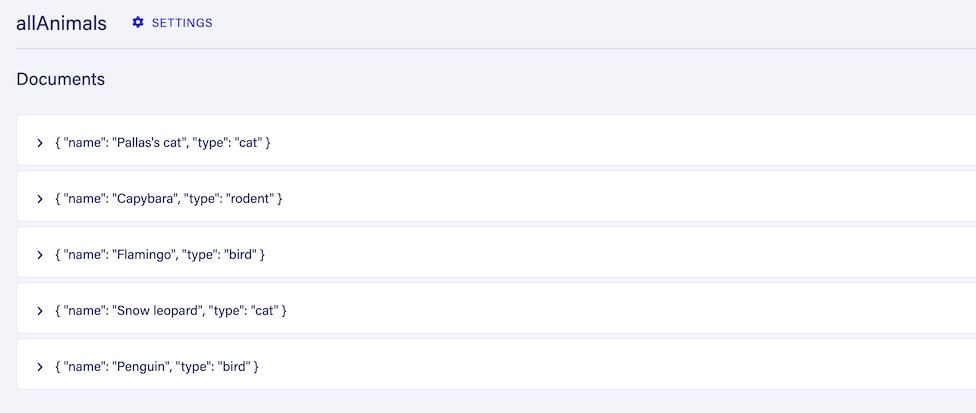

# gatsby-source-faunadb

## Install the source plugin

Enter the following into your terminal in the root directory of your Gatsby project:
```
npm install gatsby-source-faunadb
```

or, if you are using Yarn:
```
yarn add gatsby-source-faunadb
```

## Configure your project
To connect your Gatsby project to your Fauna database, add the following to the `/gatsby-config.js` file in your project directory:
```js
module.exports = {
  //...
  plugins: [
    //...
    {
      resolve: `gatsby-source-faunadb`,
      options: {
        // The secret for the key you're using to connect to your Fauna database.
        // You can generate on of these in the "Security" tab of your Fauna Console.
        secret: "___YOUR_FAUNADB_SECRET___",
        // The name of the index you want to query
        // You can create an index in the "Indexes" tab of your Fauna Console.
        index: `animalsByType`,
        // If your index requires arguments, you can specify them like this.
        // You can omit this property if your index doesn't need any.
        arguments: ["bird"],
        // This is the name under which your data will appear in Gatsby GraphQL queries
        // The following will create queries called `allBird` and `bird`.
        type: "bird",
        // If you need to limit the number of documents returned, you can specify a 
        // maximum number to read.
        size: 100
      },
    },
    //...
  ],
}
```
If you'd like to include multiple indexes in your Gatsby project you can add the above section many times, once for each index.
You can also include the same index multiple times with different arguments and types.

## Query the data
Your data will appear in your Gatesby project under the `type` name that you gave in `./gatsby-config.js`.
For example, for the config above you can query:

```graphql
query MyQuery {
  allBird {
    nodes {
      name
      type
    }
  }
}
```

or, to fetch a single document:
```graphql
query MyQuery {
  bird(name: {eq: "Flamingo"}) {
    name
    type
    _id
    _ts
  }
}
```
Note the Fauna document ID and timestamp are also available in the returned type, as `_id` and `_ts` respectively.


## Example
Given the following data in a Fauna collection: 
```json
[
  { "name": "Pallas's cat", "type": "cat" },
  { "name": "Capybara", "type": "rodent" },
  { "name": "Flamingo", "type": "bird" },
  { "name": "Snow leopard", "type": "cat" },
  { "name": "Penguin", "type": "bird" }
]
```

...and an index called `allAnimals`, that return all documents:



We can use the following configuration in `/gatsby-config.js`:
```js
module.exports = {
  plugins: [
    {
      resolve: `gatsby-source-faunadb`,
      options: {
        secret: "___YOUR_FAUNADB_SECRET___",
        index: `allAnimals`,
        type: "animal",
      },
    },
  ],
}
```

This will make our data available to query as `allAnimal` in Gatesby GraphQL:
```graphql
query MyQuery {
  allAnimal {
    nodes {
      name
      type
    }
  }
}
```

Result:
```json
{
  "data": {
    "allAnimal": {
      "nodes": [
        {
          "name": "Pallas's cat",
          "type": "cat"
        },
        {
          "name": "Capybara",
          "type": "rodent"
        },
        {
          "name": "Flamingo",
          "type": "bird"
        },
        {
          "name": "Snow leopard",
          "type": "cat"
        },
        {
          "name": "Penguin",
          "type": "bird"
        }
      ]
    }
  }
}
```


## Troubleshooting

A common issue may be that the key secret you're using doesn't have enough access to return the data. If this is the case, you'll see the following message when running `gatsby develop`:

```
 ERROR 

[PermissionDenied: permission denied] {
  name: 'PermissionDenied',
  message: 'permission denied',
  requestResult: RequestResult {
    method: 'POST',
    ...
  }
}
```

If you see this, make sure you're using the correct secret and that the associated key has the correct permissions. **Your key will need permission to read all indexes that you're using _and_ all the collections that those indexes use.**


## Get involved

Thank you for using `gatsby-source-fauna` and I hope you find it useful. If you stumble upon any issues, please consider <a href="https://github.com/paulcuth/gatsby-source-faunadb/issues">logging the issue</a> or <a href="https://github.com/paulcuth/gatsby-source-faunadb/pulls">opening a pull request</a>. All contributions very welcome.

💛<a href="https://twitter.com/paulcuth">paulcuth</a>.